# Neural Network Model Project - EE562

## 1. Introduction
In this project, we implemented four separate neural networks for segmenting optical aerial images
into the 6 different classes: buildings, low vegetation, trees, cars, background clutter, and
impervious surfaces (e.g pavement, roads). We trained on 24 high-resolution images of Potsdam,
Germany, from the International Society for Photogrammetry and Remote Sensing (ISPRS), originally
created for urban classification, 3D building classification and semantic labeling [1]. Our
four neural network models (i.e UNet, ResUNet-a, FastCNN, and efficient transformer) varied in
performance with the FastSCNN model performing the best based on our success metric. Throughout
this report, the following color scheme will be used for the semantic labeling of images: dark
blue for buildings, light blue for low vegetation, green is for trees, yellow is for cars, and red is for
background clutter, and white for impervious surfaces.

|Input|Output|
|:--------:|:--------:|
|  (a) ISPRS Dataset: Example of input aerial image | 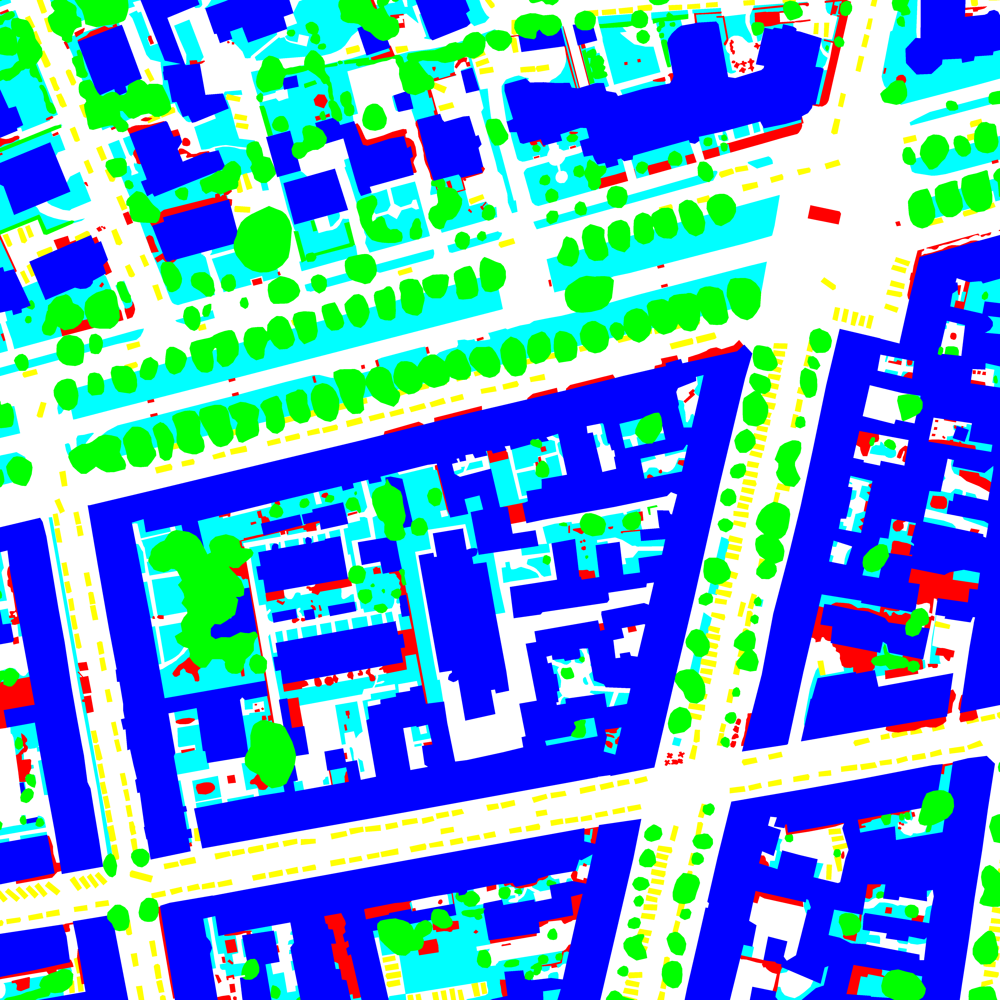 (b) Ground Truth Segmentation Label [1] |

## 2. Project Design
### 2.1 What is Semantic Segmentation?
Semantic segmentation is the process of classifying individual pixels of an image using multiple
masking layers. A semantic segmentation model takes an image of varying channels (e.g RGB,
RGBIR), and returns a bitmap of 0 or 1 to indicate coverage based on trained weights of a neural
network.
EE 562 - AI for Engineers Final Project Report
### 2.2 The Dataset
The dataset we used is optical satellite imagery data of Potsdam, Germany from the International
Society for Photogrammetry and Remote Sensing (ISPRS) [1]. The original data set is comprised
of multiple 6000×6000 pixel images and associated semantic segmentation masks. Due to the
extreme size of these images and our hardware limitations, both the images and masks were preprocessed
into smaller 256×256 images before being input into our models. The script to preprocess
these images was not written by our group. The script is from the classifier code for
ResUNet and can be found at the following link: GitHub.
The pre-processed images are 3 channel (RGB) 256×256 images where each pixel is represented
by different amounts of red, green, and blue. The pre-processed masks contain 6 class labels. Each
class label is a mapping of whether a pixel corresponds to the label or not. A zero in the label map
means the class is not present in a pixel, while a one means the class is present. The shape of the
complete mask is 6 layers of 256×256, where each layer is a class label map.

|Input|Output|
|:--------:|:--------:|
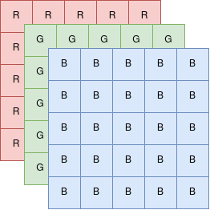 | 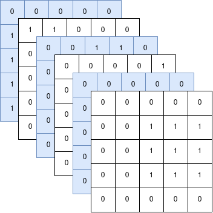|
|(a) Example of the shape of the RGB representations of images, with shape of 3 channels of 5px by 5px (reduced image size for simplicity) | (b) Example of the shape of mask representation of images with 6 classes in a 5px by 5px image.|

During training, images are loaded randomly and transformed randomly with a horizontal and/or
vertical flip. This is to ensure that the models are not seeing the exact same inputs during successive
epochs and reduce the possibility of overfitting. The image channels are also normalized to be
vaguely centered around 0. Given a channel value can be from 0 to 1, by normalizing with a mean
and standard deviation of 0.5, the channel range changes to -1 to 1.
### 2.3 Model Metrics
The metrics that we used to determine how well each model performed are the success metric
shown in section 4.1 to determine the model’s accuracy, the F1, and the mIoU. The F1 is determined
by calculating the number of true positives and dividing it by the addition of both the true positives
and the false positives. In our case, a true positive is when the model correctly calculates a pixel’s
segmentation label. A false positive is when the model incorrectly classifies a pixel as one of the
segmentation labels that it is not. The mIoU is determined by calculating the total intersection and
union between segmentation labels in the predicted output and the image label.
## 3 Models
The overall goal of the project is to compare the performance of semantic segmentation models;
however, there are numerous models that tackle semantic segmentation. To narrow down which
models to use, we searched for models that had been used for the specific task of semantically
segmenting the same type of data we are using - aerial image data. Then, we selected unique
models to compare their results. The final spread of models to compare consists of a deep learning
CNN (UNet), a deep learning CNN with residual blocks (ResUNet), an efficient CNN (FastSCNN),
and a transformer model (Efficient Transformer).
### 3.1 UNet
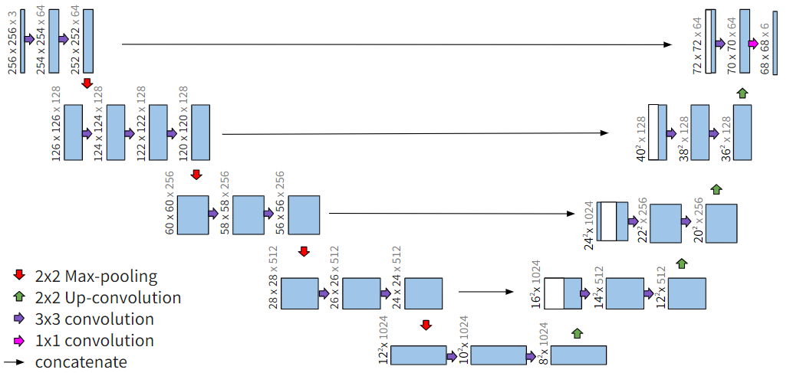

Figure 3. UNet Architecture: Batch size of 16.

This neural network consists of a contracting and expansive path, utilizing a series of convolutions,
max pooling, and up-sampling processes for the input images. In the contracting path, 3×3 pixel
convolutions with a padding of 1 were initiated, followed by a rectified linear unit (ReLU) activation
function. Then, max-pooling down sampled the resulting output of the convolutions and the
number of feature channels were doubled at every down step. After reaching a reduced size of
8×8×1024, the images undergo the expansion path using 3×3 up-convolutions with the number
of feature channels reduced by half. At every expansion step, the images are concatenated with
corresponding feature map from the contracting path to prevent excessive informational loss. At
the final layer, a 1×1 convolution is utilized to map features into the desired 6 class features. This
UNet model is an alteration of the original model by Ronneberger et. al. ”U-Net: Convolutional
Networks for Biomedical Image Segmentation” [2].

### 3.2 ResUNet
The classifier code can be found at the following link: GitHub.
ResUNet is structured the same way as UNet, but adds residual blocks and pyramid pooling [2].
Residual blocks feed both the immediately preceding layer as well as layers from further in the
past as inputs to the next layer. ResUNet uses this idea to build its residual blocks by summing
dilated batch norm convolutions with the original input. The reason Diakogiannis, et al. chose to
use residual blocks is because it helps keep the model weights from “vanishing” or “exploding”
(i.e. becoming insignificantly small or overpoweringly large), which is a common problem in deep
neural networks. Pyramid pooling does max pooling at different sizes to extract more context at
multiple scales.
As the original code for ResUNet was written with mxnet instead of Pytorch, the whole model had
to be rewritten by us to use it. There are two noticeable differences in our implementation of the
depth 6 ResUNet to the implementation described by Diakogiannis, et al.
The first is that we use cross entropy loss instead of their proposed dice loss. This is for three
reasons: 1) The paper calls out that using dice loss is “not the only option for the task of semantic
segmentation” and references many other models have used cross entropy loss for their models,
so using cross entropy loss will technically work, 2) The paper cited that dice loss “can increase
performance over the cross entropy loss” but never showed model performance comparisons, so it
was an interesting avenue to pursue, and 3) It made writing a generalizable training script easier as
all other models used cross entropy loss.
The second difference is that our model uses ResUNet instead of ResUNet-a. ResUNet-a takes advantage
of multitask learning, whereas ResUNet is single task learning. This choice was made due
to time and hardware constraints. Due to the amount of weights in the basic ResUNet architecture,
our available hardware was at best able to handle training at a batch size of 2. Adding multitask
learning would have been prohibitively heavy.

### 3.3 FastSCNN
The classifier code can be found at the following link: GitHub.
FastSCNN describes itself as a ”fast segmentation convolutional neural network.” [5] The highlight
of the model is a ”learning to downsample module,” which contains 3 layers of convolutions. The
first convolution is a standard convolution layer and the last two are depth-wise separable convolution
layers. This module feeds into a ”global feature extractor” that uses multiple convolution
layers and pyramid pooling to find features. Unlike UNet and ResUNet, which both use many skip
connections at many encoding and decoding levels, FastSCNN uses a single skip connection. This
skip connection sums the original output of the learning to downsample module and the output
of the global feature extractor. Finally, the model outputs the classes using a softmax activation
function.

### 3.4 Efficient Transformer
The classifier code can be found at the following link: GitHub.
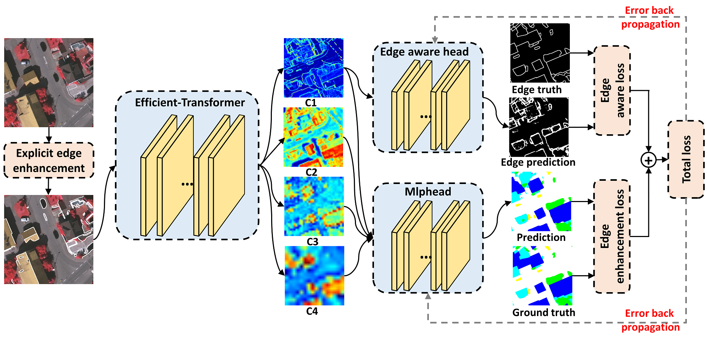
Figure 4. The Efficient Transformer Architecture.
For the transformer model, we developed a partial implementation of the efficient transformer for
remote sensing image segmentation. The proposed efficient transformer model attempts to upgrade
the Swin Transformer model by adding a pure transformer segmentation head and explicit/implicit
edge enhancement heads to remedy the main shortcomings of the Swin Transfomer. Our model
includes the Swin transformer (SwinT) with a pure segmentation Multilayer Perceptron (MLP)
head and fully convolutional network (FCN) auxiliary head. Our implementation does not include
the implicit or explicit edge enhancement head.

Typically, semantic segmentation models consist of both a backbone and a segmentation head. The
backbone of the efficient transformer is composed of a patch partitioning module, followed by four
successive cascade stages. The first cascade stage consists of a position embedding module and
an efficient transformer block. The following three stages consist of a downsample/patch partition
module and an efficient transformer block. The efficient transformer block determines the local
and global attention relationship by mapping the input height and width to smaller dimensions.
This makes the Efficient Transformer much more efficient than the Swin Transformer [3].
The MLP head is used to fuse the different scale features obtained by the efficient transformer after
each successive cascading block. After fusing the low-dimensional feature maps, the MLP head
outputs a predicted segmentation map of the original image’s resolution.

## 4 Performance Results
The objective of this project is to train four neural network architectures to semantically segment
optical images from associated segmentation labels. After training the four networks on the Potsdam
dataset, we tested the networks to determine the visual accuracy of each network’s output.
The models were tested on a predetermined set of images not seen during training.
|Input|Output| 
:-------------------------:|:-------------------------:
| 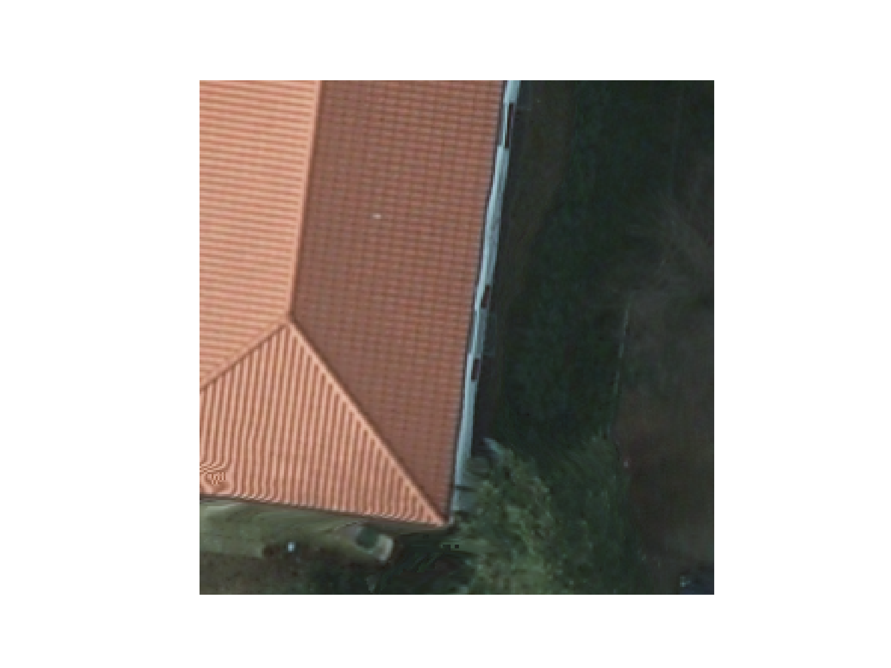 | 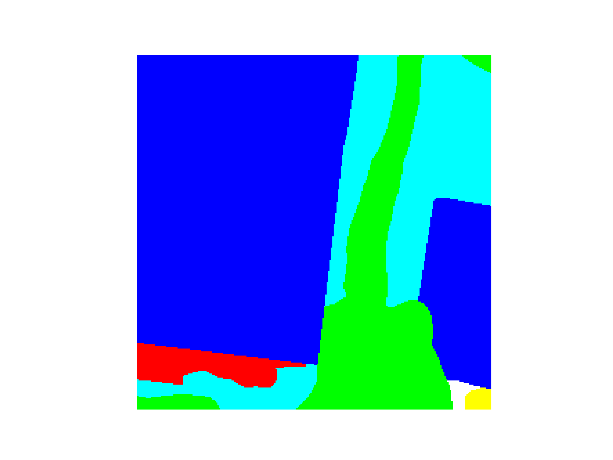 
| Original             | Ground Truth |
| 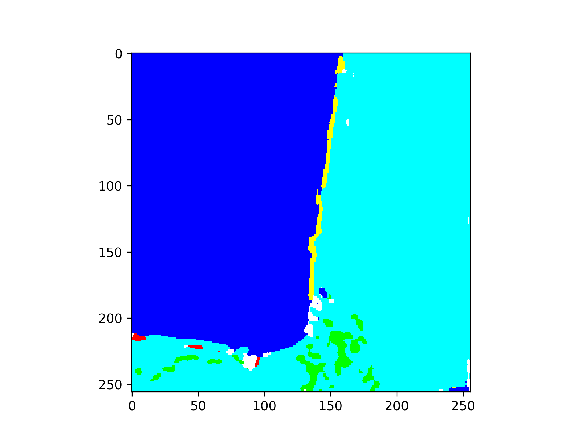 | 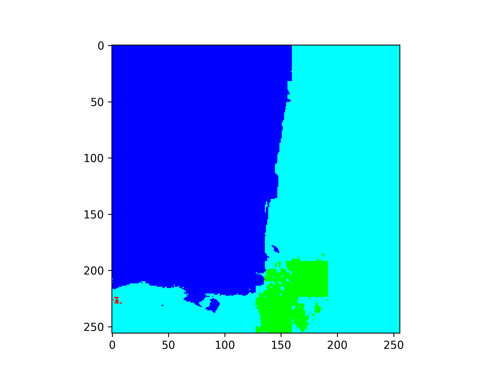 
| Unet |  ResUNet |
| 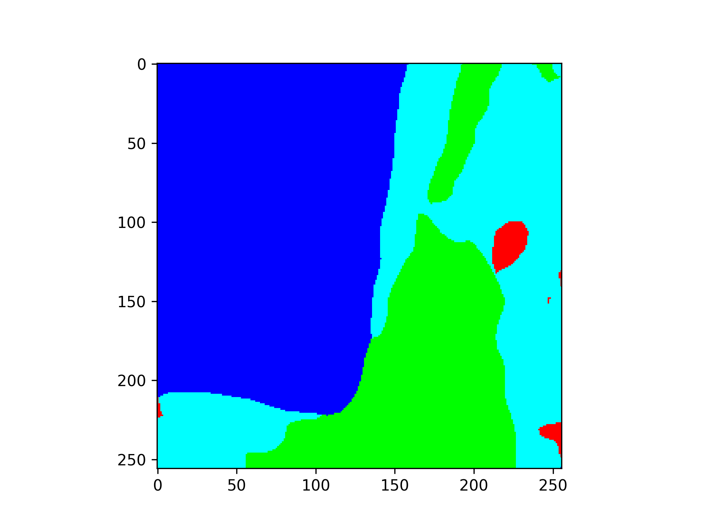 | 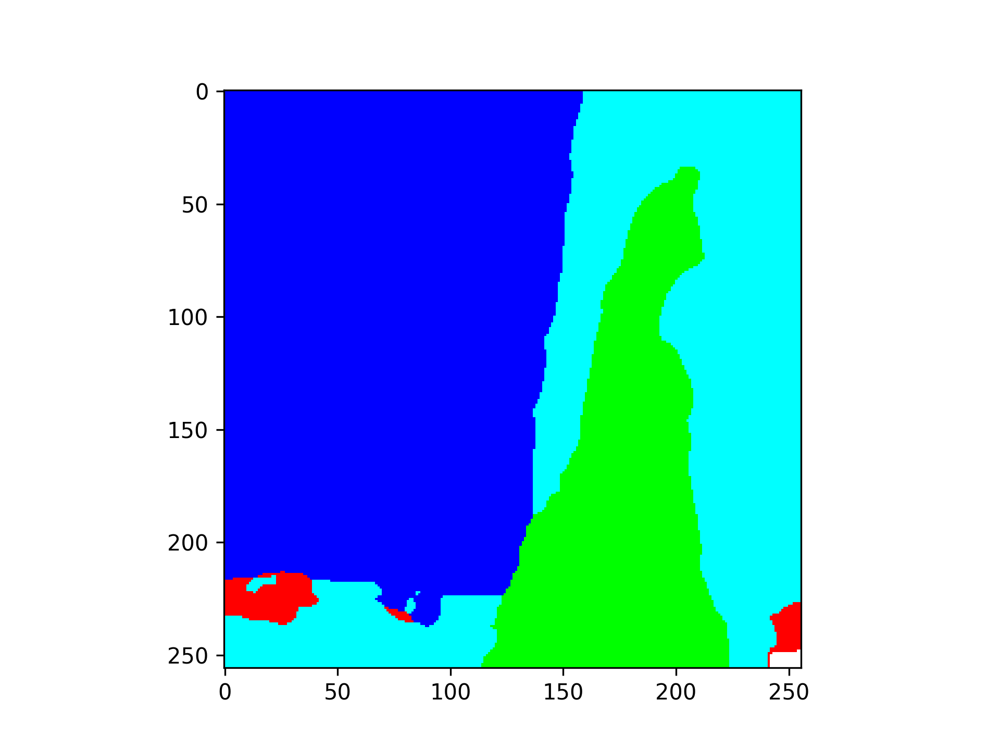 | 
| FastSCNN             |  Efficient Transformer |

Figure 5 shows each network’s segmentation output from an associated test image.

### 4.1 Success Metric
For the success metric, we utilized a pixel accuracy function that can be found at the following
link: GitHub. This function determines the total number of tensor indices that correctly identified
the segmentation class that is represented at that index. Then, it divides the number of correctly
labeled tensor indices by the size of the image to obtain the model’s accuracy.
4.2 Segmentation Results
Each model was tested on a set of validation images to determine the model’s visual accuracy.
Predicted segmentation labels for the same input image are shown in Figure 5.
Figure 5. (a) Optical satellite image, (b) ground truth semantic segmentation label, and segmentation
labels generated by the (c) UNet, (d) ResUNet, (e) FastSCNN, and the (f) Efficient Transformer.

|Model| Batch Size| Epoch| Accuracy| F1| mIoU |
:--------:|:--------:|:--------:|:--------:|:--------:|:--------:
|UNet |16| 1| 0.563668| 0.374492| 0.267580
|ResUNet |3| 1| 0.716808| 0.446289| 0.353755
|FastSCNN | 32 | 10| 0.855029| 0.853172| 0.750244
|Efficient Transformer |16| 10| 0.845004| 0.748022| 0.619644|

Table 1. Comparison of results for the four semantic segmentation models

From the metrics shown in Table 1, it is clear that the FastSCNN model performs best in all three
major categories: accuracy, F1, and mIoU. The poorest performing models were the UNet and the
ResUNet, which can be seen visually in the output images. Primarily, this is due to compute resource
limitations. The second best performing model was the efficient transformer model. When
comparing each of the predictions to the ground truth semantic segmentation label shown in Figure
5, it is clear that the FastSCNN and the efficient transformer did the best job at extracting the
features in the image. All four models accurately labeled the building on the left side of the image;
however, only the FastSCNN and efficient transformer were able to label the trees alongside the
building. Both UNet ResUNet started to capture some of the tree features, but both were sub-par.
The only model that labeled any of the background/clutter on the bottom-left side of the image
was the efficient transformer. All four models failed to label the building on the right side of
the image/ground truth label. In the future, it is desirable to allocate additional training/compute
resources to all four models. With additional time/resources, each model will certainly develop
better pixel labeling capabilities.
Due to the high computational expense of training UNet and ResUnet, these two models were
trained for 1 epoch only. (Resulted Training Time for one epoch: 13+ hr Using GPU TPU1000
NVIDIA). Given more time for training and fine-tuning, the Unet and ResUNet models may have
comparable performance as with FastSCNN and efficient transformer.

## 5 Individual Project Contributions
Code contributions can best be seen on our project GitHub.
Justin Diamond: Found Efficient Transformer paper and model, found Potsdam dataset from ISPRS,
wrote the report introduction, inserted figures into the report, wrote the efficient transformer
section and performance results section of the report.
Nicole Pham: Found ResUNet paper and model, translated ResUNet from mxnet to Pytorch,
found FastSCNN paper and model, wrote the dataloader w/ horizontal and vertical flip transforms,
wrote the training script, found and used image preprocessing script, trained ResUNet, FastSCNN,
and Efficient Transformer model, wrote Project Design, ResUNet and FastSCNN sections of report.
Sean Jung: Found UNet paper and model. Developed and trained our UNet Model. Wrote UNet
architecture section within the report and created the Figure 4 image. Created the slideshow presentation.

## 6 References
[1] Dataset: 2013 December 12, International Society for Photogrammetry and Remote Sensing
(ISPRS) Test Project on Urban Classification, 3D Building Construction and Semantic Labeling,
https://www
.isprs.org/education/benchmarks/UrbanSemLab/Default.aspx
[2] Diakogiannis, Foivos I., et al. “ResUNet-A: A deep learning framework for semantic segmentation
of remotely sensed data.” ISPRS Journal of Photogrammetry and Remote Sensing, vol. 162,
2020, pp. 94–114, https://doi.org/10.1016/j.isprsjprs.2020.01.013.
[3] Xu, Zhiyong, et al. “Efficient Transformer for remote sensing image segmentation.” Remote
Sensing, vol. 13, no. 18, 2021, p. 3585, https://doi.org/10.3390/rs13183585.
[4] Ronneberger, Olaf, Philipp Fischer, and Thomas Brox. ”U-net: Convolutional networks for
biomedical image segmentation.” Medical Image Computing and Computer-Assisted Intervention–
MICCAI 2015: 18th International Conference, Munich, Germany, October 5-9, 2015, Proceedings,
Part III 18. Springer International Publishing, 2015.
[5] Poudel, Rudra P K, et al. “Fast-SCNN: Fast Semantic Segmentation Network.” arXiv.Org, 12
Feb. 2019, arxiv.org/abs/1902.04502.